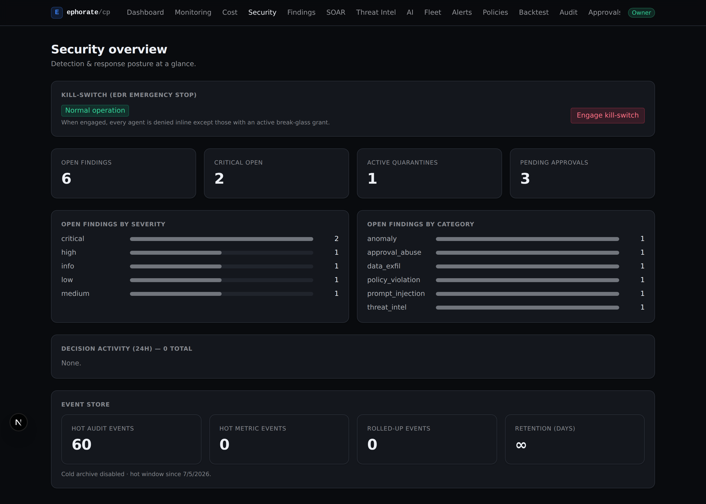

# Ephorate

**The control plane for autonomous AI agents.** Runtime policy enforcement,
tamper-evident audit, and detection &amp; response for your **Claude** and
**MCP** agents — so you can ship autonomy without ceding control.

_Agents act. Ephorate decides._

[](https://github.com/smerphy/test/actions/workflows/control-plane.yml)
[](https://github.com/smerphy/test/actions/workflows/engine.yml)
[](LICENSE)
[](https://www.python.org/)
[](sdk-typescript/)
[](CONTRIBUTING.md)



Ephorate is an open-source **AI agent security** platform. It sits between your
agents and their tools and decides — in milliseconds — whether each action is
**allowed, denied, transformed, or sent for human approval**, recording every
decision to a hash-chained audit log. When an agent misbehaves, Ephorate
**detects, contains, and helps you prove** what happened — and maps your posture
to the frameworks your auditors ask for.

Put it in front of your agents two ways: the **Python / TypeScript SDKs**, or a
**drop-in MCP proxy** that governs any MCP client with no code changes.

## Features

- 🛡️ **Runtime policy enforcement** — `allow` · `deny` · `transform` ·
  `require_approval` on every tool call, evaluated inline in milliseconds.
- 🧾 **Tamper-evident audit** — a hash-chained log of every decision, verifiable
  across languages.
- 🔬 **Detection &amp; response (SIEM / EDR)** — findings from prompt-injection,
  data-exfil kill-chains, repeated-denial bursts, UEBA anomalies, and threat
  intel, mapped to MITRE ATLAS / OWASP LLM.
- ⛔ **Containment** — per-entity **quarantine** plus an org-wide **kill-switch**
  with time-boxed **break-glass** grants.
- ⚙️ **SOAR playbooks** — match a finding, run the response (quarantine, notify,
  forward to your SIEM) in priority order; every run recorded.
- ✅ **AI compliance** — live control-posture mapping to **NIST AI RMF**, the
  **EU AI Act**, and the **OWASP LLM Top 10**, plus evidence reports with PDF
  export.
- 💸 **Cost governance (FinOps)** — meter agent LLM spend; enforce per-agent
  quotas and org budgets inline.
- 🔌 **Drop-in MCP proxy** — govern any Model Context Protocol client without
  touching its code.
- 🐍 **Python &amp; TypeScript SDKs** — Anthropic and OpenAI middleware with
  feature parity on the runtime path.

## How it fits together

Four capabilities share one control plane:

1. **Monitoring &amp; alerting** — `AnthropicMonitor` wraps your
   `anthropic.Anthropic` client and ships a metric event per Claude API call
   (model, tokens, cache tokens, latency, cost, stop reason, tools used,
   errors). The control plane stores them, exposes a dashboard, and evaluates
   threshold **alert rules** (cost spikes, p99 latency, error rate, per-model
   breakdowns) routed to Slack, PagerDuty, and generic webhooks.
2. **Runtime policy enforcement** — a declarative policy is evaluated on every
   tool call, returning `allow` · `deny` · `transform` · `require_approval` with
   a tamper-evident audit log. Ships starter compliance bundles for NIST AI RMF,
   ISO/IEC 42001, and the EU AI Act, an `agent_abuse_patterns` hardening bundle
   (36 rules), and a `prompt_injection` bundle (18 rules) covering
   prompt-injection, jailbreak, and indirect-injection / data-exfil patterns
   (OWASP LLM01/LLM02/LLM06). Candidate bundles can be **backtested** against
   recorded audit history before rollout.
3. **Detection &amp; response (SIEM / EDR)** — a detection engine correlates the
   audit + metric stream into **security findings**, each mapped to MITRE ATLAS
   / OWASP LLM with a triage lifecycle (open → triaging → resolved /
   false-positive). Findings drive **response**:
   - **per-entity quarantine** isolates an agent or session (the SDK denies its
     tool calls inline via `QuarantineGuard`), manually or automatically on a
     CRITICAL finding;
   - a **global kill-switch** halts every agent org-wide in one click, with
     time-boxed **break-glass** for the remediation agent you trust;
   - **SOAR response playbooks** run a matched finding's actions in priority
     order — every run recorded and auditable;
   - findings above a per-org severity threshold are **forwarded** to external
     SIEM / SOAR systems as OCSF-flavored events.

   Orgs also author their own **detection-as-code** rules — a bounded,
   structured match (no code/regex, never a ReDoS/RCE vector) run alongside the
   built-ins.
4. **Governance** — **live compliance posture** grades the org's controls
   against NIST AI RMF, the EU AI Act, and the OWASP LLM Top 10
   (satisfied / partial / gap, with remediation), alongside point-in-time
   evidence reports with PDF export. **Cost governance** meters agent LLM spend
   and enforces per-agent quotas and org budgets inline — over budget, the next
   call is denied.

These layers feed the same audit + reports surface so security, SRE, and
compliance teams work off one source of truth.

## Quickstart

Gate an Anthropic agent with the Python SDK:

```bash
pip install ephorate anthropic
```

```python
from ephorate import EphorateClient, load_bundle  # noqa
from ephorate.middleware.anthropic import gate_response

client = EphorateClient(
    bundle_path="policy.yaml",
    audit_log_path="audit.jsonl",
    control_plane_url="https://ephorate.example.com",  # optional
    api_key="cp-xxx",
    org_slug="acme",
    default_agent_id="research-bot",
)

# In your agent loop:
gated_response = gate_response(
    anthropic_response, client=client, session_id=session_id
)
```

Or govern an MCP server with **no code changes** — point your MCP client at the
Ephorate proxy instead of the upstream server:

```bash
pip install ephorate-mcp
ephorate-mcp --config ephorate-mcp.example.yaml
```

The full Quickstart, DSL reference, audit-log spec, and framework-mapping guide
live in [`docs/`](docs/).

## Repository layout

```
engine/          policy engine (Python): types, predicate AST, evaluator,
                 parser, CLI, JSON-schema export, starter compliance bundles
sdk-python/      ephorate: Anthropic/OpenAI middleware, audit log, approval flow,
                 quarantine guard, control-plane shipping
sdk-typescript/  @ephorate/sdk: TS port with feature parity for the runtime path
mcp-proxy/       ephorate-mcp: MCP gateway (stdio + streamable-HTTP) wrapping the
                 policy gate — bearer auth, per-session identity, health probes,
                 Prometheus metrics, tool-output DLP
control-plane/   FastAPI + SQLAlchemy + Alembic + Celery: ingestion, search,
                 approvals, findings, quarantine/kill-switch, SOAR, compliance,
                 FinOps, compliance reports (with PDF), OAuth
web/             Next.js 15 control-plane console (light + dark themes)
docs/            Nextra docs site
examples/        end-to-end demo agents
```

## Development

Python workspace via [uv](https://docs.astral.sh/uv/):

```bash
uv sync --all-packages --all-extras
uv run pytest engine sdk-python control-plane mcp-proxy
```

TypeScript workspace via pnpm:

```bash
pnpm install
pnpm --filter @ephorate/sdk test
pnpm --filter ephorate-web build
pnpm --filter ephorate-docs build
```

## Testing

- **engine** — pytest + Hypothesis property tests + p99 evaluation budget gate
- **sdk-python** — pytest, including cross-language chain interop with the TS SDK
- **control-plane** — pytest with FastAPI TestClient against in-memory SQLite
- **mcp-proxy** — pytest against the policy gate + transport plumbing
- **sdk-typescript** — Vitest

## Contributing

Contributions welcome — see [CONTRIBUTING.md](CONTRIBUTING.md). Report security
issues via [SECURITY.md](SECURITY.md).

## License

[Apache 2.0](LICENSE).

---

<sub>Keywords: AI agent security · LLM guardrails · runtime policy enforcement ·
MCP proxy · prompt-injection detection · AI governance · SIEM / EDR for AI
agents · NIST AI RMF · EU AI Act · OWASP LLM Top 10 · agent audit log.</sub>
